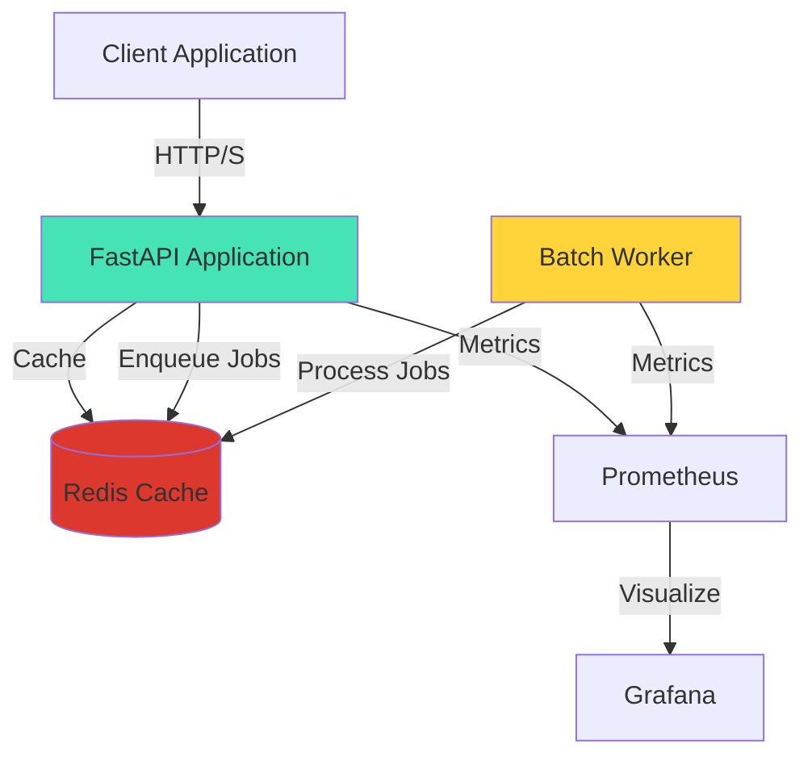

# MailSafePro Email Validation API

<div align="center">

**Enterprise-grade email validation API with advanced security, SMTP verification, and breach detection**

[](https://mailsafepro.betteruptime.com)
[](https://render.com)
[](https://gdpr.eu)

[Features](#features) • [Quick Start](#quick-start) • [Documentation](#documentation) • [Architecture](#architecture) • [SDKs](#sdks)

</div>

---

## 🚀 Features

### Core Validation
- ✅ **RFC 5322 Syntax Validation** - Standards-compliant email format checking
- ✅ **SMTP Verification** - Real mailbox existence checking
- ✅ **DNS/MX Record Analysis** - Domain deliverability validation
- ✅ **Disposable Email Detection** - Block temporary email services
- ✅ **Role-based Email Detection** - Identify generic addresses (info@, admin@)
- ✅ **Typo Suggestions** - Catch common domain misspellings

### Advanced Security
- 🔒 **SPF/DKIM/DMARC Validation** - Email authentication protocols
- 🔒 **Breach Detection** - Integration with Have I Been Pwned
- 🔒 **Spam Trap Detection** - Honeypot and toxic address identification
- 🔒 **Risk Scoring** - Multi-factor risk assessment (0-100)

### Enterprise Capabilities
- 🎯 **Batch Processing** - Async validation of thousands of emails
- 🎯 **Priority Queues** - Plan-based job prioritization
- 🎯 **Webhook Callbacks** - HMAC-signed completion notifications
- 🎯 **Multi-tier Plans** - FREE, PREMIUM, ENTERPRISE with quotas
- 🎯 **API Key Management** - Create, rotate, revoke keys with grace periods

### Infrastructure
- 🌍 **EU-based (Frankfurt)** - GDPR-compliant hosting on Render
- 📊 **Prometheus Metrics** - Production-grade observability
- ⚡ **Redis Caching** - Sub-second response times
- 🔄 **99.95% Uptime SLA** - 24/7 monitoring with Better Uptime

---

## 🏁 Quick Start

### 1. Authentication

All requests require an API key. Get yours by registering:

```bash
curl -X POST https://email-validation-api-jlra.onrender.com/auth/register \
  -H "Content-Type: application/json" \
  -d '{
    "email": "your@email.com",
    "password": "your-secure-password",
    "plan": "FREE"
  }'
```

### 2. Validate a Single Email

```bash
curl -X POST https://email-validation-api-jlra.onrender.com/v1/validate-email \
  -H "X-API-Key: YOUR_API_KEY" \
  -H "Content-Type: application/json" \
  -d '{"email": "test@example.com"}'
```

**Response:**
```json
{
  "email": "test@example.com",
  "valid": true,
  "risk_score": 15,
  "risk_level": "low",
  "deliverable": true,
  "smtp_checked": true,
  "disposable": false,
  "role_based": false,
  "breached": false,
  "dns": {
    "has_mx": true,
    "mx_records": ["mail.example.com"],
    "spf_valid": true,
    "dmarc_policy": "quarantine"
  },
  "suggestion": null,
  "provider": "example",
  "response_time_ms": 427
}
```

### 3. Batch Validation

```bash
curl -X POST https://email-validation-api-jlra.onrender.com/v1/jobs \
  -H "Authorization: Bearer YOUR_JWT_TOKEN" \
  -H "Content-Type: application/json" \
  -d '{
    "emails": ["user1@test.com", "user2@test.com"],
    "callback_url": "https://yourapp.com/webhook",
    "mode": "full"
  }'
```

---

## 📚 Documentation

### Interactive API Docs

- **Swagger UI**: [https://email-validation-api-jlra.onrender.com/docs](https://email-validation-api-jlra.onrender.com/docs)
- **ReDoc**: [https://email-validation-api-jlra.onrender.com/redoc](https://email-validation-api-jlra.onrender.com/redoc)
- **Status Page**: [https://mailsafepro.betteruptime.com](https://mailsafepro.betteruptime.com)

### Key Endpoints

| Endpoint | Method | Auth | Description |
|----------|--------|------|-------------|
| `/auth/register` | POST | None | Create new account |
| `/auth/login` | POST | None | Get JWT token |
| `/v1/validate-email` | POST | API Key | Single email validation |
| `/v1/validate-advanced` | POST | JWT | Advanced validation with SMTP |
| `/v1/jobs` | POST | JWT | Create batch job |
| `/v1/jobs/{id}` | GET | JWT | Get job status |
| `/v1/jobs/{id}/results` | GET | JWT | Paginated results |
| `/usage` | GET | JWT | Check quota usage |
| `/health` | GET | None | Health check |

---

## 🏗️ Architecture



### Tech Stack

- **Framework**: FastAPI 0.104+ (Python 3.11+)
- **Cache/Queue**: Redis 7
- **Authentication**: JWT + API Keys (HMAC-SHA256)
- **Payments**: Stripe
- **Monitoring**: Prometheus + Grafana
- **Deployment**: Docker + Render
- **DNS Resolution**: aiodns + dnspython
- **SMTP Verification**: aiosmtplib

---

## 🔑 Authentication

### API Key (FREE Plan)

```bash
curl -H "X-API-Key: your_api_key" \
  https://email-validation-api-jlra.onrender.com/v1/validate-email
```

### JWT Bearer Token (PREMIUM/ENTERPRISE)

```bash
# 1. Login to get token
TOKEN=$(curl -X POST https://email-validation-api-jlra.onrender.com/auth/login \
  -H "Content-Type: application/json" \
  -d '{"email":"you@email.com","password":"yourpass"}' | jq -r .access_token)

# 2. Use token
curl -H "Authorization: Bearer $TOKEN" \
  https://email-validation-api-jlra.onrender.com/v1/validate-advanced
```

---

## 📊 Plans & Pricing

| Feature | FREE | PREMIUM | ENTERPRISE |
|---------|------|---------|------------|
| Daily Validations | 100 | 10,000 | Unlimited |
| SMTP Verification | ❌ | ✅ | ✅ |
| Batch Jobs | ❌ | ✅ | ✅ |
| Breach Detection | ❌ | ✅ | ✅ |
| Priority Support | ❌ | ✅ | ✅ |
| SLA | 99.5% | 99.95% | 99.99% |
| Webhooks | ❌ | ✅ | ✅ |
| Custom Integration | ❌ | ❌ | ✅ |

---

## 🛠️ SDKs

### Official SDKs

- **Python**: [mailsafepro-python](https://pypi.org/project/mailsafepro/)
  ```bash
  pip install mailsafepro
  ```

- **JavaScript/TypeScript**: [mailsafepro-js](https://www.npmjs.com/package/mailsafepro)
  ```bash
  npm install mailsafepro
  ```

- **Zapier Integration**: Available in [Zapier App Directory](https://zapier.com/apps/mailsafepro)

### SDK Examples

**Python:**
```python
from mailsafepro import MailSafeProClient

client = MailSafeProClient(api_key="YOUR_API_KEY")
result = client.validate("test@example.com")
print(f"Valid: {result.valid}, Risk: {result.risk_score}")
```

**JavaScript:**
```javascript
import { MailSafeProClient } from 'mailsafepro';

const client = new MailSafeProClient({ apiKey: 'YOUR_API_KEY' });
const result = await client.validate('test@example.com');
console.log(`Valid: ${result.valid}, Risk: ${result.riskScore}`);
```

---

## 🚀 Local Development

### Prerequisites

- Python 3.11+
- Docker & Docker Compose
- Redis (via Docker)

### Setup

```bash
# Clone repository
git clone https://github.com/yourusername/mailsafepro-api.git
cd mailsafepro-api

# Create virtual environment
python3 -m venv .venv
source .venv/bin/activate  # On Windows: .venv\Scripts\activate

# Install dependencies
pip install -r requirements.txt

# Copy environment template
cp .env.example .env
# Edit .env with your configuration

# Start services with Docker Compose
docker compose up -d

# Run API locally
uvicorn app.main:app --reload --port 8000

# Run worker
python -m app.jobs.jobs_worker
```

### Access Locally

- API: http://localhost:8000
- Swagger Docs: http://localhost:8000/docs
- Prometheus: http://localhost:9090
- Grafana: http://localhost:3000 (admin/admin)

---

## 🔒 Security

### Security Features

- ✅ Rate limiting per IP and user
- ✅ XSS protection with CSP headers
- ✅ HTTPS enforcement in production
- ✅ HSTS, X-Frame-Options, Referrer-Policy headers
- ✅ Content-Type validation
- ✅ JWT with expiration and refresh tokens
- ✅ API key rotation with grace periods
- ✅ Webhook signature verification (HMAC)

### Reporting Security Issues

Please report security vulnerabilities to: **security@mailsafepro.com**

Do not open public issues for security vulnerabilities.

---

## 📈 Performance

### Response Times (P95)

- Single validation: <500ms
- With SMTP: <2s
- Batch jobs: Processes 1000 emails in ~45s

### Caching Strategy

- MX Records: 1 hour TTL
- Domain reputation: 24 hours TTL
- Validation results: 5 minutes TTL

---

## 🧪 Testing

```bash
# Run all tests
pytest tests/ -v

# With coverage
pytest tests/ --cov=app --cov-report=html

# Run specific test file
pytest tests/test_validation.py -v
```

---

## 📦 Deployment

### Environment Variables

See `.env.example` for full configuration options. Key variables:

```bash
# Application
ENVIRONMENT=production
SECRET_KEY=your-secret-key

# Redis
REDIS_URL=redis://localhost:6379/0

# JWT
JWT_SECRET=your-jwt-secret
JWT_ALGORITHM=HS256

# Stripe
STRIPE_SECRET_KEY=sk_live_...
STRIPE_WEBHOOK_SECRET=whsec_...

# Rate Limiting
RATE_LIMIT_PER_MINUTE=30
```

### Docker Deployment

```bash
# Build image
docker build -t mailsafepro-api .

# Run container
docker run -d \
  -p 8000:8000 \
  --env-file .env \
  mailsafepro-api
```

---

## 🤝 Contributing

We welcome contributions! Please see [CONTRIBUTING.md](CONTRIBUTING.md) for guidelines.

### Development Workflow

1. Fork the repository
2. Create feature branch (`git checkout -b feature/amazing-feature`)
3. Commit changes (`git commit -m 'Add amazing feature'`)
4. Push to branch (`git push origin feature/amazing-feature`)
5. Open Pull Request

---

## 📝 License

This project is licensed under the MIT License - see [LICENSE](LICENSE) file for details.

---

## 🆘 Support

- **Documentation**: [https://docs.mailsafepro.com](https://email-validation-api-jlra.onrender.com/docs)
- **Email**: support@mailsafepro.com
- **Status Page**: [https://mailsafepro.betteruptime.com](https://mailsafepro.betteruptime.com)
- **GitHub Issues**: [Report a bug](https://github.com/yourusername/mailsafepro-api/issues)

---

<div align="center">

**Built with ❤️ for email deliverability**

[Website](https://mailsafepro.com) • [API Docs](https://email-validation-api-jlra.onrender.com/docs) • [Status](https://mailsafepro.betteruptime.com)

</div>