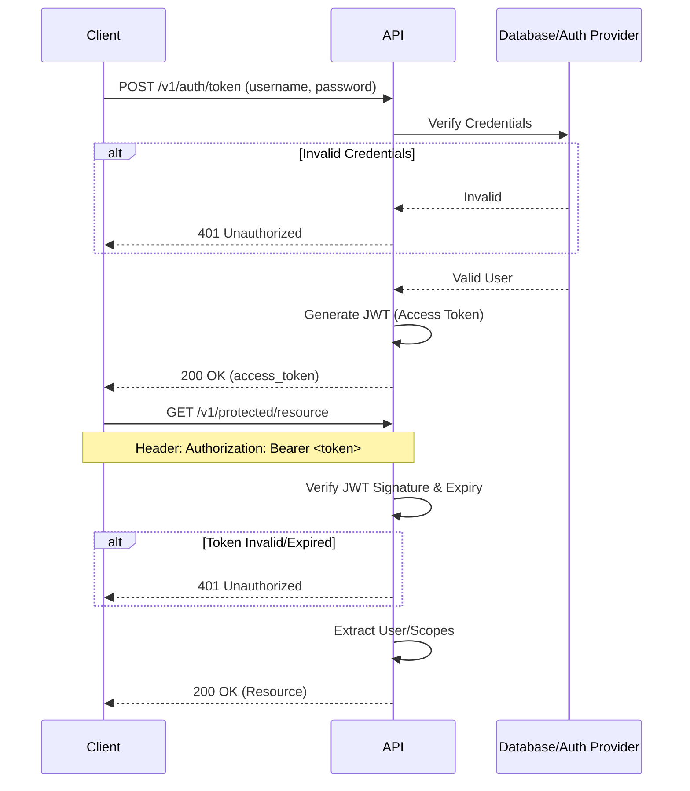

# Authentication Flow

This diagram illustrates the JWT authentication flow.

```mermaid
sequenceDiagram
    participant Client
    participant API
    participant DB as Database/Auth Provider
    
    %% Login
    Client->>API: POST /v1/auth/token (username, password)
    API->>DB: Verify Credentials
    alt Invalid Credentials
        DB-->>API: Invalid
        API-->>Client: 401 Unauthorized
    end
    
    DB-->>API: Valid User
    API->>API: Generate JWT (Access Token)
    API-->>Client: 200 OK (access_token)
    
    %% Protected Request
    Client->>API: GET /v1/protected/resource
    Note over Client,API: Header: Authorization: Bearer <token>
    
    API->>API: Verify JWT Signature & Expiry
    alt Token Invalid/Expired
        API-->>Client: 401 Unauthorized
    end
    
    API->>API: Extract User/Scopes
    API-->>Client: 200 OK (Resource)
```
