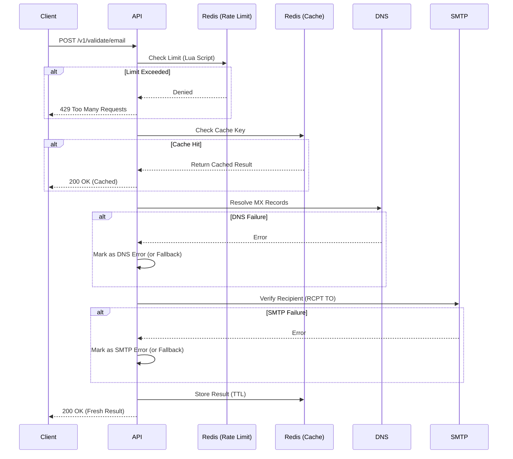

# Validation Flow

This diagram illustrates the flow of a request to the `/v1/validate/email` endpoint.

```mermaid
sequenceDiagram
    participant Client
    participant API
    participant RateLimiter as Redis (Rate Limit)
    participant Cache as Redis (Cache)
    participant DNS
    participant SMTP
    
    Client->>API: POST /v1/validate/email
    
    %% Rate Limiting
    API->>RateLimiter: Check Limit (Lua Script)
    alt Limit Exceeded
        RateLimiter-->>API: Denied
        API-->>Client: 429 Too Many Requests
    end
    
    %% Caching
    API->>Cache: Check Cache Key
    alt Cache Hit
        Cache-->>API: Return Cached Result
        API-->>Client: 200 OK (Cached)
    end
    
    %% Validation Logic
    API->>DNS: Resolve MX Records
    alt DNS Failure
        DNS-->>API: Error
        API->>API: Mark as DNS Error (or Fallback)
    end
    
    API->>SMTP: Verify Recipient (RCPT TO)
    alt SMTP Failure
        SMTP-->>API: Error
        API->>API: Mark as SMTP Error (or Fallback)
    end
    
    %% Response & Caching
    API->>Cache: Store Result (TTL)
    API-->>Client: 200 OK (Fresh Result)
```
